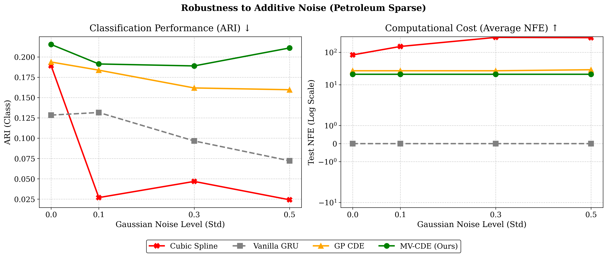
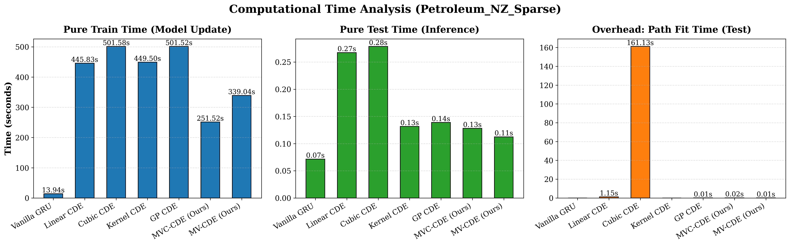
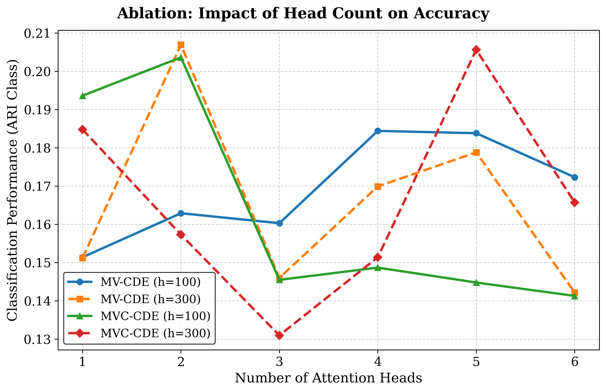
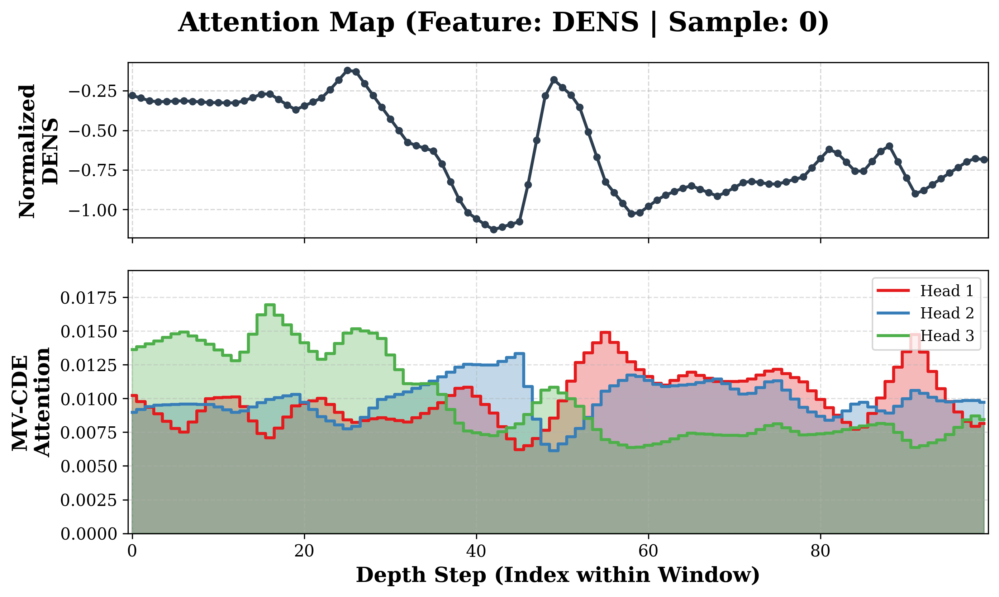

# Efficient Neural CDEs for Similarity Learning in Petroleum Engineering

[](https://www.python.org/downloads/release/python-390/)
[](https://pytorch.org/)

Official repository for the paper **"Efficient Neural Controlled Differential Equations for Similarity Learning via Attentive Kernel Smoothing in Petroleum Engineering"**. 

The full paper is available in this repository at **[`report/report.pdf`](report/report.pdf)**.

## Contributions

Interwell correlation via deep metric learning is heavily hindered by the extreme sparsity of real-world well logs. Standard Neural Controlled Differential Equations (Neural CDEs) can theoretically handle this irregularity, but exact interpolation (e.g., cubic splines) over missing data induces pathological mathematical stiffness, causing ODE solvers to stall.

Our main contributions are:
1. **Continuous-Depth Processing:** We process raw, sparse sensor data without relying on heuristic imputation (zero-padding or forward-filling) that distorts physical relationships.
2. **GP Path Regularization:** We replace exact splines with Gaussian Process (GP) smoothing, natively bypassing missing data gaps and decoupling ODE integration cost from sensor noise.
3. **MVC-CDE Architecture:** We introduce the Multi-View Convolutional Neural CDE, which uses a 1D-CNN and learnable attention queries to dynamically aggregate multiple GP paths of varying spatial scales, preserving both high-frequency geological boundaries and global trends.

## Key Results

Our models were evaluated on a highly sparse, real-world petroleum dataset from the Taranaki Basin (New Zealand) using a Triplet Margin Loss metric learning setup.

### 1. Robustness to Additive Noise
Unlike standard architectures (Vanilla GRU, Cubic CDE) that collapse entirely under sensor noise, our MVC-CDE explicitly filters perturbations during the continuous path construction phase. It maintains high clustering accuracy (ARI Class > 0.21) and a strictly constant inference cost of 21.0 NFE across all noise levels.

<p align="center">
  
</p>

### 2. Computational Efficiency
Standard Neural CDEs spend the vast majority of their time inside the iterative ODE solver attempting to traverse high-frequency spline boundaries. By supplying the ODE solver with mathematically regularized GP trajectories, our approach reduces the pure integration time and overall training time by a factor of 2 to 3.

<p align="center">
  
</p>

### 3. Multi-Scale Representation & Interpretability
Ablation studies show that aggregating 3 to 5 distinct spatial scales yields optimal geological representations. The attention mechanism provides interpretability: specific heads activate sharply on local signal spikes to preserve lithofacies boundaries, while others track macroscopic baselines.

<p align="center">
  
  
</p>

## Getting Started

### 1. Environment Setup
We provide Docker scripts for reproducible execution with GPU support. First, configure your credentials by copying the template:
```bash
cp credentials.example credentials
```
Adjust the paths inside `credentials` if needed. Build and launch the container:
```bash
bash build
bash launch_container
```

### 2. Data Preparation
1. Place the raw New Zealand (Taranaki Basin) and Norway datasets into the `data/` directory.
2. Inside the Docker container, run the preprocessing script. This script applies geological filters and prepares the sparse dataset without artificial filling:
```bash
python run_prettifier_and_eda.py
```

### 3. Training & Evaluation
To run an experiment, use the `run.sh` script, specifying the task (`main`), the GPU ID (e.g., `0`), and the configuration YAML file.

Example: Running our flagship MVC-CDE model:
```bash
./run.sh main 0 ./main/configs/nz_top_mvc.yaml
```

Example: Running the baseline Cubic Spline Neural CDE:
```bash
./run.sh main 0 ./main/configs/nz_baseline.yaml
```

The pipeline automatically evaluates metric learning clustering (ARI), logs ODE solver steps (NFE), tests noise robustness, and extracts attention maps to the `experiment_petroleum_sparse/` directory.

## Future Work

We are actively expanding this research in several directions:
- **Zero-Shot Transfer Learning:** Evaluating the transferability of learned GP smoothing parameters from the New Zealand basin to the highly diverse Norwegian offshore dataset.
- **Extended Baselines:** Benchmarking against discrete linear-time state-space models (e.g., Mamba) to further investigate the speed-accuracy tradeoff on sparse sequences.
- **Downstream Tasks:** Extending the continuous latent state evolution to perform generative sequence imputation and point-wise classification.

## Citation

If you find this code or our concepts useful in your research, please cite our paper:
```bibtex
@misc{serov2026efficient,
  title         = {Efficient Neural Controlled Differential Equations via Attentive Kernel Smoothing},
  author        = {Serov, Egor and Kuleshov, Ilya and Zaytsev, Alexey},
  year          = {2026},
  eprint        = {2602.02157},
  archivePrefix = {arXiv},
  primaryClass  = {cs.LG},
  url           = {https://arxiv.org/abs/2602.02157}
}
```